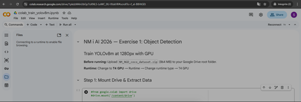
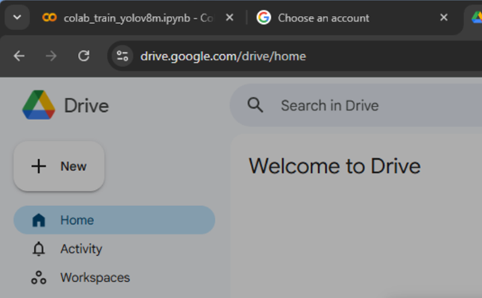

# NM i AI 2026 — Competition workspace

Working repository for the three **NM i AI 2026** tracks (19–22 March 2026).

---

## Tracks

| # | Name | Folder | Status |
|---|------|--------|--------|
| 1 | **Object Detection** (NorgesGruppen Data) | [`object_detection_ng/`](object_detection_ng/) | **Implemented, tested, and submitted to the platform** |
| 2 | Tripletex AI Accounting Agent | *(separate project)* | *(implemented https://github.com/IgnacioTejeraPicossi/AI-Accounting-Agent-Tripletex-NM-i-AI-2026 )*  |
| 3 | Astar Island | *(separate project)* | *(implemented https://github.com/IgnacioTejeraPicossi/Viking-Civilisation-Prediction-Astar-Island-NM-i-AI-2026 )* |


---

## Exercise 1: what it is and what the solution does

**Goal:** detect and classify grocery products in shelf photos (Norwegian retail data).

**Model output:** JSON predictions in competition format: `image_id`, `category_id`, COCO `bbox` [x, y, w, h], `score`.

**Official score:**  
`0.7 × detection mAP @ IoU 0.5 (class-agnostic) + 0.3 × classification mAP @ IoU 0.5 (correct class)`.

### Status: complete and tested (baseline)

| Check | Result |
|-------|--------|
| Local pipeline | COCO analysis → YOLO conversion → training → inference → hybrid metric validation |
| `submission/run.py` | Meets sandbox rules (`pathlib`, no blocked imports) |
| Local smoke test (`test_run_local.py`) | OK: JSON format, 248 images, runtime &lt; 300 s on reference CPU |
| **Platform submission** | **Done** — evaluation OK in GPU sandbox (NVIDIA L4) |
| **Public leaderboard score (baseline)** | **0.3889** (first submission: YOLOv8s trained on CPU, imgsz 640) |
| Sandbox runtime | ~19 s (well under the 300 s limit) |

The code lives under **`object_detection_ng/`**: scripts in `src/`, weights and `run.py` in `submission/`, and **`submission.zip`** built with `build_submission.py` for upload at  
[Submit — NorgesGruppen Data](https://app.ainm.no/submit/norgesgruppen-data).

### Completed improvement: Colab + Google Drive (YOLOv8m @ 1280)

We **carried out** GPU training on **[Google Colab](https://colab.research.google.com)** using **`object_detection_ng/colab_train_yolov8m.ipynb`**: **YOLOv8m** at **1280×1280**, **T4 GPU** runtime. The training dataset **`NM_NGD_coco_dataset.zip`** (~864 MB) was kept on **Google Drive** and/or downloaded in Colab with **`gdown`** when **`drive.mount`** was not available. After training, **`best.pt`** was taken from Colab (`/content/runs/.../weights/`), copied to **`object_detection_ng/submission/best.pt`**, and **`submission.zip`** was built on the PC with **`python src/build_submission.py`** for upload to the platform.

**Full workflow** (Drive vs `gdown`, `unzip -o`, PyTorch / wandb / OOM fixes, local zip): **[`object_detection_ng/README.md`](object_detection_ng/README.md)** → **“Google Colab & Google Drive (GPU training)”**.

| Colab notebook (`colab_train_yolov8m.ipynb`) — YOLOv8m @ 1280, T4 | Browser: Colab tab + Google Drive (dataset zip) |
|:---:|:---:|
|  |  |


---

## Documentation 

| Resource | Link |
|----------|------|
| **Docs index** (all Markdown files) | [`docs/README.md`](docs/README.md) |
| Competition quick start | [`docs/Getting_Started.md`](docs/Getting_Started.md) |
| Official task copy: Overview, Submission, Scoring, Examples | [`docs/Overview.md`](docs/Overview.md), [`docs/Submission.md`](docs/Submission.md), [`docs/Scoring.md`](docs/Scoring.md), [`docs/Examples.md`](docs/Examples.md) |
| Implementation plan (Exercise 1, YOLOv8 pipeline) | [`docs/Object_Detection_Exercise1_Plan.md`](docs/Object_Detection_Exercise1_Plan.md) |
| Implemented codebase (Exercise 1) | [`object_detection_ng/README.md`](object_detection_ng/README.md) |

> Legacy filename `docs/Getting Starting.md` redirects to `Getting_Started.md`.

---

## Quick repo layout

```
AI NM i AI 2026/
├── README.md                 ← this file
├── docs/                     ← English docs + competition Markdown
└── object_detection_ng/      ← Exercise 1 (code + local data)
```
